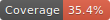

[](https://travis-ci.com/LABS-EU3/lambdaDoor_frontend)  [](https://app.netlify.com/sites/lambdadoor/deploys)

# LamdaDoor

Many atimes Job seekers find it difficult getting information specific to their search with respect to companies' interview processes, cultures and salary information that are less generalized, hence they spend alot of time searching and filtering what's needed from the sea of available information.

LambdaDoor is here to make that search simpler by providing stream lined information that are specific to companies and regions, even providing connections to previous job seekers that have intervied or work(ed) with these firms.

===============================================================================

## Tech stack

HTML, CSS, Ant design, Formik, Styled-Component, Javascript, React, Redux, coveralls, Axios, Travis CI etc.

===============================================================================

## Contributors

|                                          [ Jessica Eze ](https://github.com/Ofega)                                           |                                      [ Emily Abrahart ](https://github.com/EmilyAbrahart)                                      |                                                [ Martins O.U ](https://github.com/Martins-O-U)                                                 |                                      [Ifiok Udoidiok ](https://github.com/ifiokudoidiok)                                       |                                       [ Victor Arowo ](https://github.com/VictorArowo)                                        |                                         [ Lisa Wilton ](https://github.com/ziggyss)                                         |
| :--------------------------------------------------------------------------------------------------------------------------: | :----------------------------------------------------------------------------------------------------------------------------: | :--------------------------------------------------------------------------------------------------------------------------------------------: | :----------------------------------------------------------------------------------------------------------------------------: | :---------------------------------------------------------------------------------------------------------------------------: | :-------------------------------------------------------------------------------------------------------------------------: |
|    [](https://github.com/Ofega)    | [](https://github.com/EmilyAbrahart) |          [](https://github.com/Martins-O-U)          | [](https://github.com/ifiokudoidiok) | [](https://github.com/VictorArowo)  |  [](https://github.com/ziggyss)   |
|                      [ ](https://github.com/Ofega)                      |                   [ ](https://github.com/EmilyAbrahart)                   |                            [ ](https://github.com/Martins-O-U)                            |                   [ ](https://github.com/ifiokudoidiok)                   |                   [ ](https://github.com/VictorArowo)                    |                    [ ](https://github.com/ziggyss)                     |
| [  ](https://www.linkedin.com/in/jessica-eze/) | [  ](https://www.linkedin.com/in/emilyabrahart/) | [  ](https://www.linkedin.com/in/onyedikachi-martins-28b890101/) | [  ](https://www.linkedin.com/in/ifiokudoidiok/) | [  ](https://www.linkedin.com/in/victor-arowo/) | [  ](https://www.linkedin.com/in/lisawilton/) |

|                                      [Ogbonna Basil](https://github.com/basilcea) - Team Lead                                      |
| :--------------------------------------------------------------------------------------------------------------------------------: |
|     [](https://github.com/basilcea)      |
|                       [ ](https://github.com/basilcea)                        |
| [  ](https://www.linkedin.com/in/ogbonna-basil-cea/) |

<br>

## Project Overview

[Trello Board](https://trello.com/b/YdfO1w9X/lambda-door) Contains Product breakdown and user story for each feature.

[Product Canvas](https://www.notion.so/EU3-Lambda-Door-e78fd9396061487b8b458a28912d66c4)
Contains information on the survey, technical researches, style guide and design consideration.

[UX Design files](<https://www.figma.com/file/S43H7Y36xwlBNkzuik4v1w/Ant-Design-System-UI-Kit-(1.0)-(%2Bexamples)?node-id=212%3A153>)
Contains files of the created designs for the App.

===============================================================================

This project was bootstrapped with [Create React App](https://github.com/facebook/create-react-app).

===============================================================================

## Available Scripts

In the project directory, you can run: `yarn start` or `npm start`
which runs the app in the development mode.<br>
Open [http://localhost:3000](http://localhost:3000) to view it in the browser.

### Other Scripts

Other scripts available on the app are:

- **npm install** to install all required dependencies
- **npm test** to start server using testing environment

===============================================================================

## Installation Instructions

- Clone this repo
- change directory to root folder
- Run npm install
- Run npm start

===============================================================================

### Environment Variables

An environment virriable was used for the developement and deployment file, thus user must set up their own environment variables in an .env file.

===============================================================================

## Repo structure

Sometimes it's helpful to know what all these different files are for…
```
/
├─ src/
│  ├─ assets/        # Assets
│  │  ├─ img/     # Raster images (used in component examples)
│  │
│  ├─ components/    # Components
│  │  ├─ Layouts/    # …that govern macro layout
│  │  ├─ Router/     # …that handles all files that pertain to app routing
│  │  ├─ templates/  # …that combine components to render page
|  |
|  ├─ pages/         # Pages
│  │  ├─ Home/       # …that renders Home-specific content
│  │  ├─ UserDashboard/ # …that renders User-Dashboard content
│  |
|  |─ state/         # State
│  │  ├─ actions/    # …that handles redux actions
│  │  ├─ reducers/   # …that handles app reducer functions
│  │  ├─ types/      # …that handles all action types 
|  |
|  |─ styles/        # Styles
|  |
|  |─ utils/         # Components
│  │  ├─ hooks/      # …that handles reusable custom logic
|
├─ .env/              # Contains environment variables(ignored by Git)
├─ www/              # Public build (ignored by Git)
│
├─ .editorconfig     # Code style definitions
├─ .gitignore        # List of files and folders not tracked by Git
├─ .prettierrc       # Code Formatting preferences for JavasScript
├─ .eslintrc         # Linting preferences for JavasScript
├─ fractal.js        # Configuration for Fractal
├─ gulpfile.js       # Configuration for Gulp tasks
├─ LICENSE           # License information for this project
├─ package.json      # Project manifest
└─ README.md         # This file
```

===============================================================================

## Contributing

When contributing to this repository, please first discuss the change you wish to make via issue, email, or any other method with the owners of this repository before making a change.

## Issue/Bug Request

**If you are having an issue with the existing project code, please submit a bug report under the following guidelines:**

- Check first to see if your issue has already been reported.
- Check to see if the issue has recently been fixed by attempting to reproduce the issue using the latest master branch in the repository.
- Create a live example of the problem.
- Submit a detailed bug report including your environment & browser, steps to reproduce the issue, actual and expected outcomes, where you believe the issue is originating from, and any potential solutions you have considered.

===============================================================================

## Requests

### Pull Requests

If you have developed a patch, bug fix, or new feature that would improve this app, please submit a pull request. It is best to communicate your ideas with the developers first before investing a great deal of time into a pull request to ensure that it will mesh smoothly with the project.
Remember that this project is licensed under the MIT license, and by submitting a pull request, you agree that your work will be, too.

### Pull Request Guidelines

- Ensure any install or build dependencies are removed before the end of the layer when doing a build.
- Update the README.md with details of changes to the interface, including new plist variables, exposed ports, useful file locations and container parameters.
- Ensure that your code conforms to our existing code conventions and test coverage.
- Include the relevant issue number, if applicable.
- You may merge the Pull Request in once you have the sign-off of two other developers, or if you do not have permission to do that, you may request the second reviewer to merge it for you.

### Feature Requests

We would love to hear from you about new features which would improve this app and further the aims of our project. Please provide as much detail and information as possible to show us why you think your new feature should be implemented.

===============================================================================

### Attribution

These contribution guidelines have been adapted from [this good-Contributing.md-template](https://gist.github.com/PurpleBooth/b24679402957c63ec426).

### Frontend is deployed on https://Lambdadoor.com

===============================================================================

## Backend

### Backend Documentation

See [Lambda_Door](https://github.com/LABS-EU3/lambdaDoor_backend/blob/develop/README.md) for details on the backend of our project.

### Backend is hosted on Heroku https://lambdadoor.herokuapp.com/

===============================================================================
